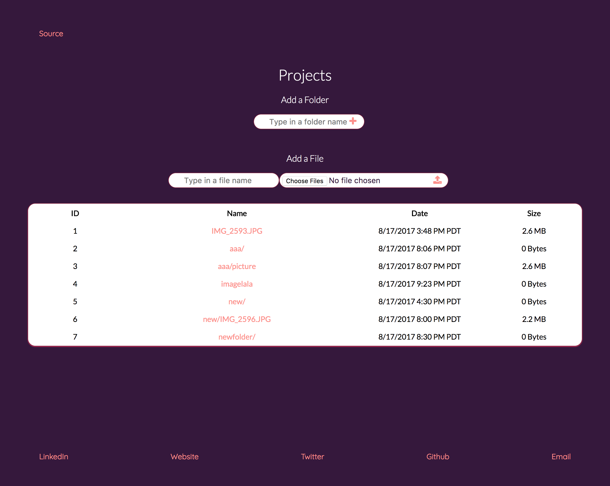

This is a little app that basically creates an interface to an underlying S3 filesystem.

## Intention:
-

## Design:
-

## Logic:
-

## Running Locally:
1. `git clone https://github.com/BeccaSheldon/react-file-uploader.git`
2. `yarn` or `npm install`
3. `npm start` or `node_modules/.bin/webpack-dev-server` for hot reloading

## Screenshot:

#
####  Thanks for taking the time to check out this repo and README.<3
#